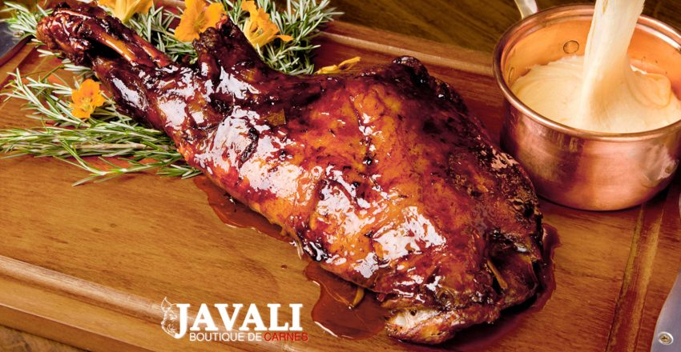

# Paleta de Javali na Brasa

## Ingredientes:

1 paleta (pernil dianteiro) de javali pesando cerca de 5kg

## Para a Salmoura

1/2 litro de água filtrada
1 colher (sopa) de sal grosso
1 colher de sopa de alho picadinho
1 colher (sopa) de cebolinha verde picada

## Modo de Preparo

A paleta vai inteira para a grelha, sem nenhum tipo de tempero, onde deve ficar 
durante 2 horas e meia a uma distância de 1 metro do braseiro, sendo virada 
de vez em quando.

Depois desse tempo, baixar a grelha para 40cm de distância do braseiro e deixar 
durante mais 15 minutos de cada lado, agora sim regando com a salmoura a cada virada.